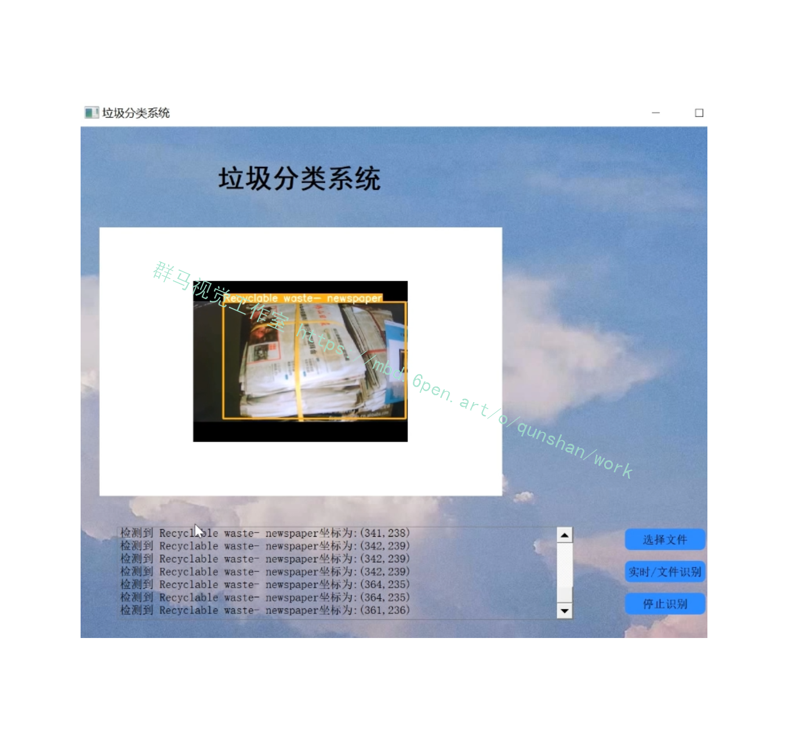
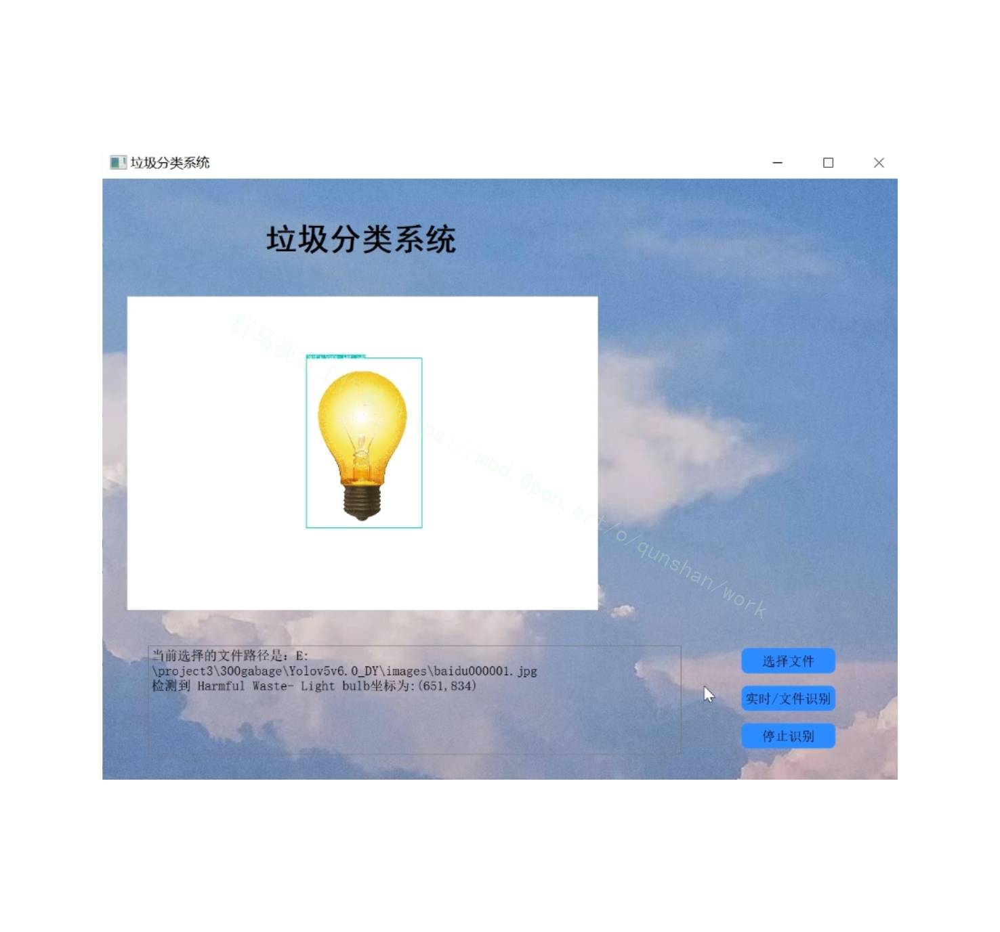
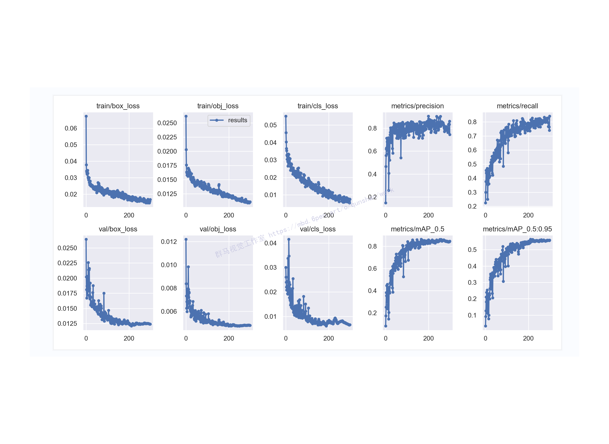
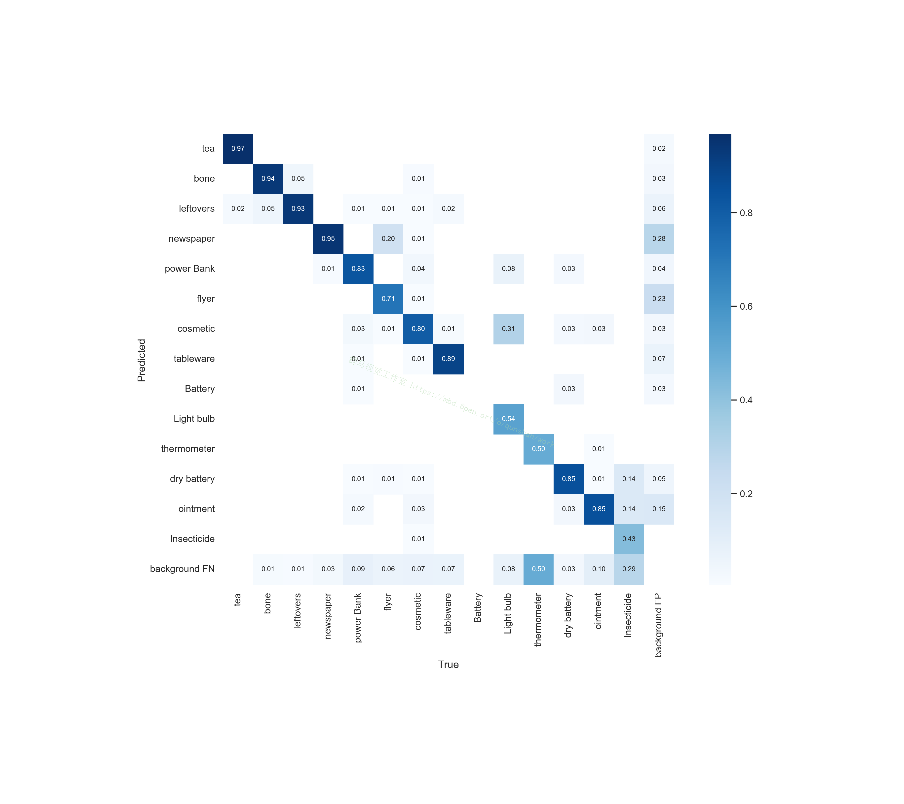
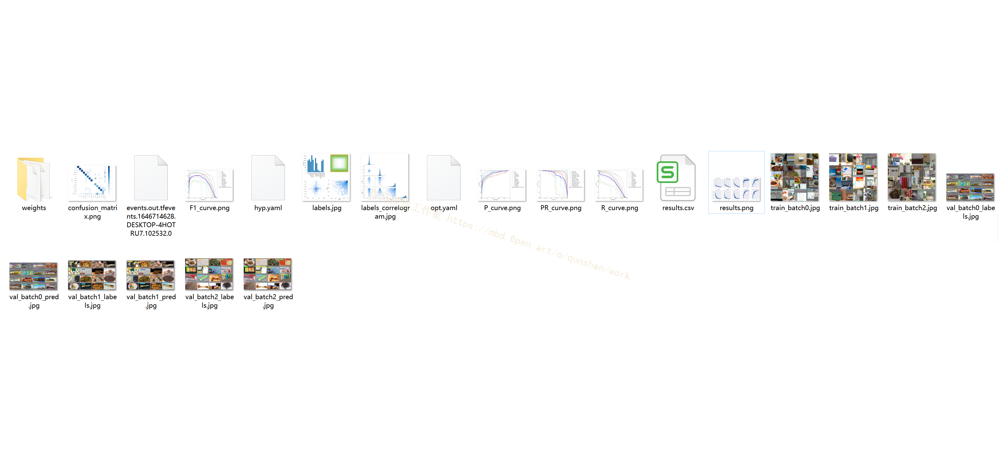
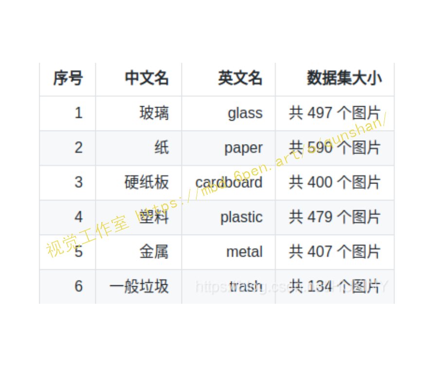
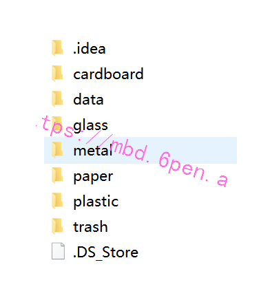
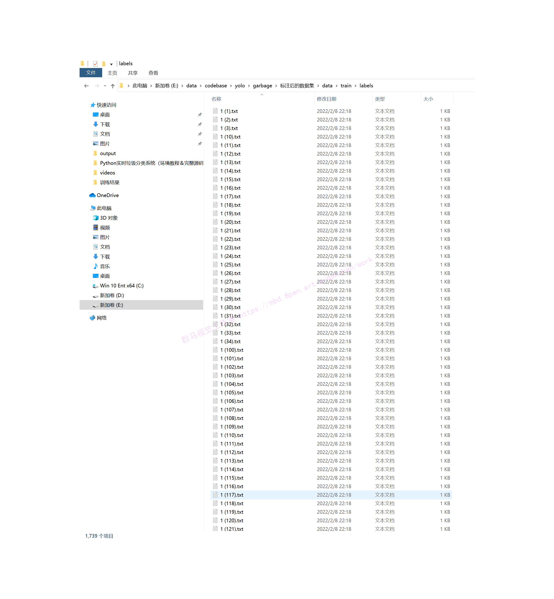


# 1.背景
如今，垃圾分类已成为社会热点话题。其实在2019年4月26日，我国住房和城乡建设部等部门就发布了《关于在全国地级及以上城市全面开展生活垃圾分类工作的通知》，决定自2019年起在全国地级及以上城市全面启动生活垃圾分类工作。到2020年底，46个重点城市基本建成生活垃圾分类处理系统。
人工垃圾分类投放是垃圾处理的第一环节，但能够处理海量垃圾的环节是垃圾处理厂。然而，目前国内的垃圾处理厂基本都是采用人工流水线分拣的方式进行垃圾分拣，存在工作环境恶劣、劳动强度大、分拣效率低等缺点。在海量垃圾面前，人工分拣只能分拣出极有限的一部分可回收垃圾和有害垃圾，绝大多数垃圾只能进行填埋，带来了极大的资源浪费和环境污染危险。
随着深度学习技术在视觉领域的应用和发展，让我们看到了利用AI来自动进行垃圾分类的可能，通过摄像头拍摄垃圾图片，检测图片中垃圾的类别，从而可以让机器自动进行垃圾分拣，极大地提高垃圾分拣效率。

# 2.识别效果



# 3.视频演示
[[项目分享]Python实时垃圾分类系统（环境教程＆完整源码＆数据集)_哔哩哔哩_bilibili](https://www.bilibili.com/video/BV1cU4y1r7AS?spm_id_from=333.999.0.0&vd_source=bc9aec86d164b67a7004b996143742dc)


# 4.训练结果
[参考博客](https://afdian.net/item?plan_id=f3215d585da211ed90e152540025c377)
### Precision＆Recall＆Map＆So on

### 混淆矩阵

### 其他参数结果图

# 5.数据集
[参考博客提供的数据集](https://mbd.pub/o/bread/Yp6amZlw)
该数据集包含了 2507 个生活垃圾图片。数据集的创建者将垃圾分为了 6 个类别，分别是：

分类如下：

完成标注信息：

# 6.代码实现
```
"""定制resnet后面的层"""
def custom(input_size,num_classes,pretrain):
    # 引入初始化resnet50模型
    base_model = ResNet50(weights=pretrain,
                          include_top=False,
                          pooling=None,
                          input_shape=(input_size,input_size, 3),
                          classes=num_classes)
    #由于有预权重，前部分冻结，后面进行迁移学习
    for layer in base_model.layers:
        layer.trainable = False
    #添加后面的层
    x = base_model.output
    x = layers.GlobalAveragePooling2D(name='avg_pool')(x)
    x = layers.Dropout(0.5,name='dropout1')(x)
    #regularizers正则化层，正则化器允许在优化过程中对层的参数或层的激活情况进行惩罚
    #对损失函数进行最小化的同时，也需要让对参数添加限制，这个限制也就是正则化惩罚项，使用l2范数
    x = layers.Dense(512,activation='relu',kernel_regularizer= regularizers.l2(0.0001),name='fc2')(x)
    x = layers.BatchNormalization(name='bn_fc_01')(x)
    x = layers.Dropout(0.5,name='dropout2')(x)
    #40个分类
    x = layers.Dense(num_classes,activation='softmax')(x)
    model = Model(inputs=base_model.input,outputs=x)
    #模型编译
    model.compile(optimizer="adam",loss = 'categorical_crossentropy',metrics=['accuracy'])
    return model
```
```
class Net():
    def __init__(self,img_size,gar_num,data_dir,batch_size,pretrain):
        self.img_size=img_size
        self.gar_num=gar_num
        self.data_dir=data_dir
        self.batch_size=batch_size
        self.pretrain=pretrain

    def build_train(self):
        """迁移学习"""
        model = resnet.custom(self.img_size, self.gar_num, self.pretrain)
        model.summary()

        train_sequence, validation_sequence = genit.gendata(self.data_dir, self.batch_size, self.gar_num, self.img_size)

        epochs=4
        model.fit_generator(train_sequence,steps_per_epoch=len(train_sequence),epochs=epochs,verbose=1,validation_data=validation_sequence,
                                     max_queue_size=10,shuffle=True)
        #微调,在实际工程中，激活函数也被算进层里，所以总共181层，微调是为了重新训练部分卷积层，同时训练最后的全连接层
        layers=149
        learning_rate=1e-4
        for layer in model.layers[:layers]:
            layer.trainable = False
        for layer in model.layers[layers:]:
            layer.trainable = True
        Adam =adam(lr=learning_rate, decay=0.0005)
        model.compile(optimizer=Adam, loss='categorical_crossentropy', metrics=['accuracy'])

        model.fit_generator(train_sequence,steps_per_epoch=len(train_sequence),epochs=epochs * 2,verbose=1,
            callbacks=[
                callbacks.ModelCheckpoint('./models/garclass.h5',monitor='val_loss', save_best_only=True, mode='min'),
                callbacks.ReduceLROnPlateau(monitor='val_loss', factor=0.1,patience=10, mode='min'),
                callbacks.EarlyStopping(monitor='val_loss', patience=10),],
            validation_data=validation_sequence,max_queue_size=10,shuffle=True)

        print('finish train,look for garclass.h5')
```
# 参考博客[《Python实时垃圾分类系统（环境教程＆完整源码＆数据集)》](https://s.xiaocichang.com/s/379b5a)

# 8.参考文献
**1.[期刊论文]**基于语音识别的FIV垃圾分类助力系统的设计和实现

**期刊：**《价值工程》 | 2021 年第 014 期

**摘要：**经济的增长带动消费的升级,使环境隐患日益突出,垃圾分类已经成为新型城市发展的制约因素.而中国开始执行垃圾分类开始时间尚短,多数城市刚刚开始或未开始,大多数居民未系统的学习垃圾分类知识,迫切需要垃圾分类指导.本文基于语音识别知识,应用LD3320语音识别芯片,开发设计一款语音识别APP和智能垃圾桶,方便人们垃圾所属分类查询,助推垃圾分类高效化.

**关键词：**语音识别；垃圾分类；LD3320芯片；智能化

**链接：**[https://www.zhangqiaokeyan.com/academic-journal-cn_value-engineering_thesis/0201290241878.html](https://link.zhihu.com/?target=https%3A//www.zhangqiaokeyan.com/academic-journal-cn_value-engineering_thesis/0201290241878.html%3Ffrom%3Dlzhh-3-2-1-4p-9255)

---------------------------------------------------------------------------------------------------

**2.[期刊论文]**高校垃圾分类现状及优化配置研究——以安阳工学院为例

**期刊：**《安阳工学院学报》 | 2021 年第 004 期

**摘要：**采用调查法对安阳工学院不同功能分区的垃圾类型、数量、垃圾桶配置进行研究,探讨常见垃圾产生的变化规律并分析校园垃圾分类存在的问题,研究优化垃圾桶配置对校园垃圾处理的影响.

**关键词：**垃圾分类；高校；优化配置

**链接：**[https://www.zhangqiaokeyan.com/academic-journal-cn_journal-anyang-institute-technology_thesis/0201290188308.html](https://link.zhihu.com/?target=https%3A//www.zhangqiaokeyan.com/academic-journal-cn_journal-anyang-institute-technology_thesis/0201290188308.html%3Ffrom%3Dlzhh-3-2-1-4p-9255)

---------------------------------------------------------------------------------------------------

**3.[期刊论文]**"无废城市"建设下的城市生活垃圾分类现状探析——以兰州市为例

**期刊：**《北方环境》 | 2021 年第 001 期

**摘要：**普遍推行生活垃圾分类制度已是生态文明建设的国家制度.以甘肃省兰州市为例,通过采用非定点拦截访问、行为观察与网络问卷调查相结合的方式,对兰州市生活垃圾分类现状展开调研,在梳理垃圾分类过程中存在的问题的基础上,提出了相应的措施与建议,为兰州市乃至西北其它城市地区的生活垃圾分类管理提供决策参考.

**关键词：**无废城市；生活垃圾；分类现状；解决对策

**链接：**[https://www.zhangqiaokeyan.com/academic-journal-cn_northern-environment_thesis/0201290189489.html](https://link.zhihu.com/?target=https%3A//www.zhangqiaokeyan.com/academic-journal-cn_northern-environment_thesis/0201290189489.html%3Ffrom%3Dlzhh-3-2-1-4p-9255)

---------------------------------------------------------------------------------------------------

**4.[期刊论文]**基于卷积神经网络的光伏供电智能垃圾分类系统设计

**期刊：**《电子世界》 | 2021 年第 010 期

**链接：**[https://www.zhangqiaokeyan.com/academic-journal-cn_electronics-world_thesis/0201290232849.html](https://link.zhihu.com/?target=https%3A//www.zhangqiaokeyan.com/academic-journal-cn_electronics-world_thesis/0201290232849.html%3Ffrom%3Dlzhh-3-2-1-4p-9255)

---------------------------------------------------------------------------------------------------

**5.[期刊论文]**基于环保型酵素的垃圾分类习惯推广研究

**期刊：**《中国科技纵横》 | 2021 年第 010 期

**摘要：**校园垃圾分类的推广是持续性的宣教内容,渗透式教育是实现校园垃圾分类的渐进、高阶的实践教育.环保的推广及其认识在垃圾分类教学实践中的运用研究,有利于学生提升化学环保意识,有利于从学科兴趣带进家庭,把垃圾分类实践活动走进社区.

**关键词：**酵素；垃圾分类；化学素养；环保意识

**链接：**[https://www.zhangqiaokeyan.com/academic-journal-cn_chinese-technology_thesis/0201290327614.html](https://link.zhihu.com/?target=https%3A//www.zhangqiaokeyan.com/academic-journal-cn_chinese-technology_thesis/0201290327614.html%3Ffrom%3Dlzhh-3-2-1-4p-9255)

---------------------------------------------------------------------------------------------------

**6.[学位论文]**桂林市城市生活垃圾分类试点政策执行的问题及对策研究

**目录**

**著录项**

**学科：**公共管理改革与发展

**授予学位：**硕士

**年度：**2021

**正文语种：**中文语种

**链接：**[https://www.zhangqiaokeyan.com/academic-degree-domestic_mphd_thesis/020316296144.html](https://link.zhihu.com/?target=https%3A//www.zhangqiaokeyan.com/academic-degree-domestic_mphd_thesis/020316296144.html%3Ffrom%3Dlzhh-3-2-1-4p-9255)

---------------------------------------------------------------------------------------------------

**7.[学位论文]**居民垃圾分类行为形成机制研究

**目录**

**著录项**

**学科：**工商管理

**授予学位：**硕士

**年度：**2021

**正文语种：**中文语种

**链接：**[https://www.zhangqiaokeyan.com/academic-degree-domestic_mphd_thesis/020316290822.html](https://link.zhihu.com/?target=https%3A//www.zhangqiaokeyan.com/academic-degree-domestic_mphd_thesis/020316290822.html%3Ffrom%3Dlzhh-3-2-1-4p-9255)


---
#### 如果您需要更详细的【源码和环境部署教程】，除了通过【系统整合】小节的链接获取之外，还可以通过邮箱以下途径获取:
#### 1.请先在GitHub上为该项目点赞（Star），编辑一封邮件，附上点赞的截图、项目的中文描述概述（About）以及您的用途需求，发送到我们的邮箱
#### sharecode@yeah.net
#### 2.我们收到邮件后会定期根据邮件的接收顺序将【完整源码和环境部署教程】发送到您的邮箱。
#### 【免责声明】本文来源于用户投稿，如果侵犯任何第三方的合法权益，可通过邮箱联系删除。